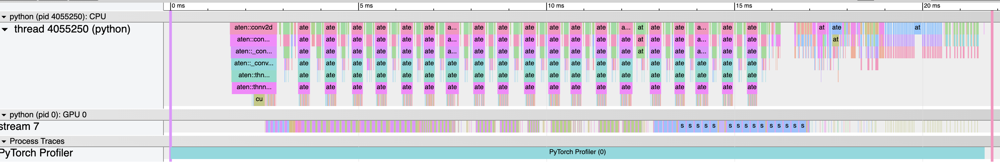
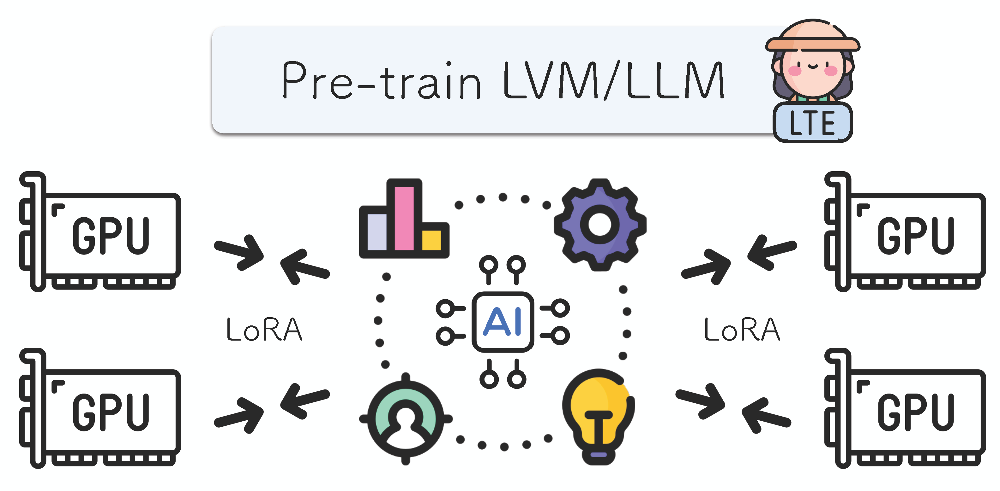
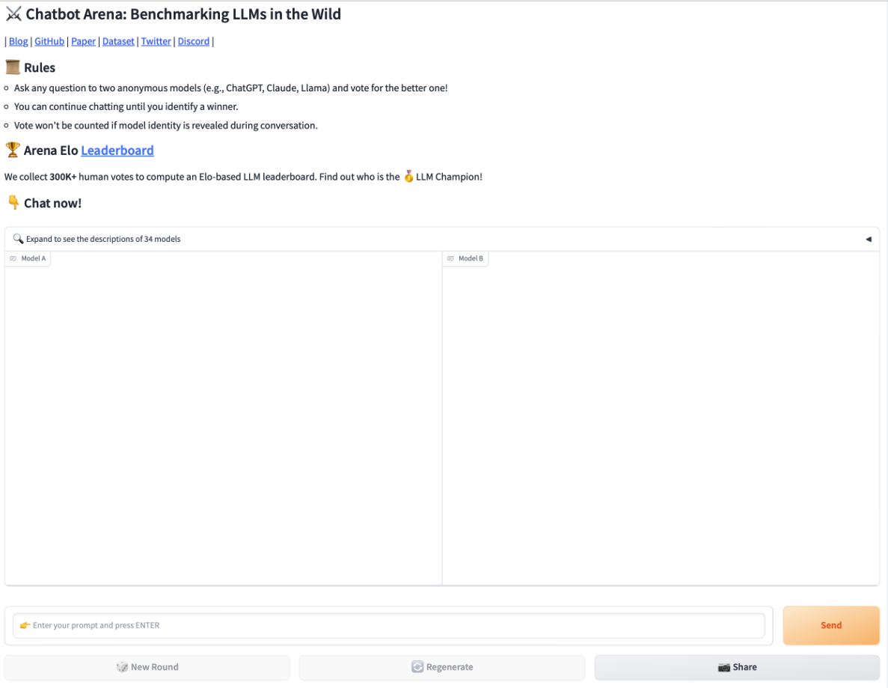

# 2024.02.28
## torch profiler
* https://pytorch.org/tutorials/recipes/recipes/profiler_recipe.html
* profile로 감싸면 나중에 chrome 포맷 json 떨궈줌 (chrome://tracing)
```
model = models.resnet18().cuda()
inputs = torch.randn(5, 3, 224, 224).cuda()

with profile(activities=[ProfilerActivity.CPU, ProfilerActivity.CUDA]) as prof:
    model(inputs)

prof.export_chrome_trace("trace.json")
```


## Mobilama
* meta 쪽 모바일 타겟 경량화 연구
	* MobiLlama: Towards Accurate and Lightweight Fully Transparent GPT
		* 0.5b 모델 정도 타게팅
		* 섹션 3.2의 FFN 레이어 파라미터 공유로 파라미터 수 낮춤
	* https://github.com/mbzuai-oryx/MobiLlama
	* https://huggingface.co/papers/2402.16840

## Federated Learning with Lora?
* GPU별로 lora 어댑터를 두는 방식으로 pretraining 하는 방법
* Training Neural Networks From Scratch with Parallel Low-Rank Adapters - Huh et al. 24
	* https://twitter.com/iScienceLuvr/status/1762414135222911424
	* https://minyoungg.github.io/LTE/
* 여러 GPU의 lora 어댑터 각각 취합하여 베이스 모델을 학습
* lora로 한 federated learning 느낌


## Preference 얻는 UI 생각
* 생성 결과 preference 얻기에 lmsys 같은 인터페이스 좋아보임 (모델 a vs b)


