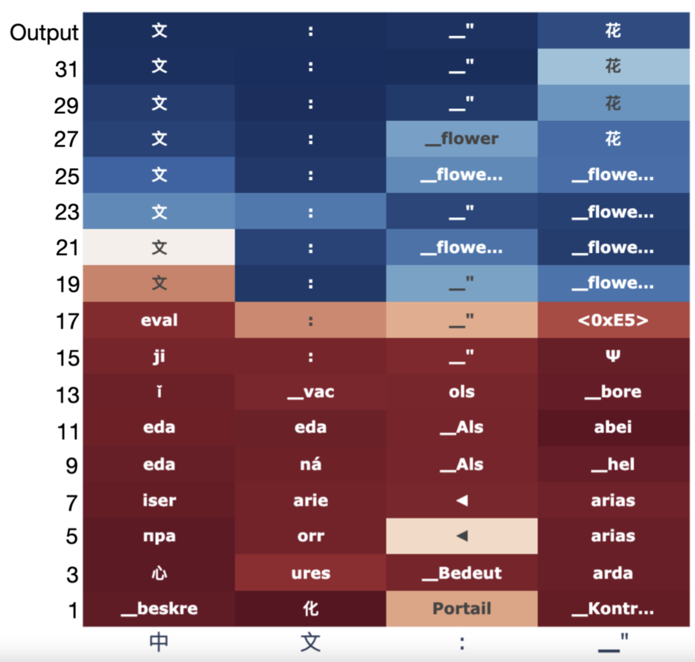

# 2024.02.29
## LLM은 내부에서 먼저 영어로 생각할까
[LLM은 내부에서 먼저 영어로 생각할까]
ex. 불어 -> 중국어 번역을 할때 내부에서 불어 -> 영어 -> 중국어 방식으로 처리되고 있을까에 대한 연구

* Do Llamas Work in English? On the Latent Language of Multilingual Transformers - Wendler et al. 24
	* https://arxiv.org/abs/2402.10588
	* 위 그림: "fleur" - 中文: "의 입력에 대해 마지막 토큰들의 레이어별 상대적 토큰 logit 값
		* 토큰 값: 각 레이어에 LM Head를 붙였을 때 선정되는 토큰
		* 색: 선정된 토큰의 엔트로피값 (빨강: 높음, 파랑: 낮음)
	* https://twitter.com/OwainEvans_UK/status/1762712860403384346
		* 정확히 영어는 아닌 latent space로 변환된다고는 하지만 그게 영어랑 가까운 편인다고는 함
		* XOR 같은 operator 개념들은 언어별 큰 차이가 없다고 함