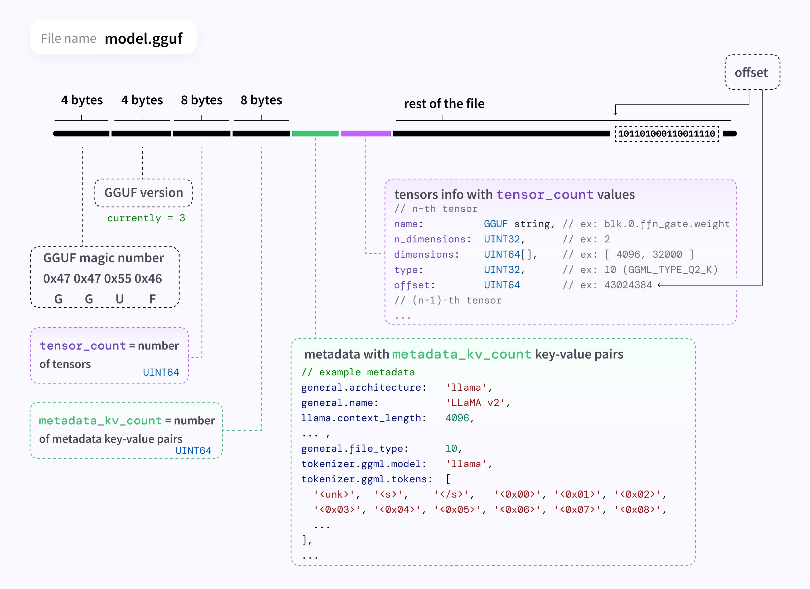

# 2024.03.27
## vector search를 binary vector로?
* "> 0" 기준으로 만든 binary vector의 cosine similarity 만으로도 괜찮은 retrieval 가능하다고 함
	* binary로 먼저 빠르게 후보군 취합 -> KNN으로 accurate similarity search reranking
		* KNN is well-suited for scenarios where we need to work with smaller sets
	* 메모리 & 속도 이점이 매우 큰편이라 고려해볼만함
	* https://twitter.com/simonw/status/1772490100188012601
	* "My binary vector search is better than your FP32 vectors"
		* https://simonwillison.net/2024/Mar/26/binary-vector-search/
		* https://blog.pgvecto.rs/my-binary-vector-search-is-better-than-your-fp32-vectors
* cohere 쪽에서 아예 binary embedding 제공
	* https://twitter.com/Nils_Reimers/status/1772715969950994493
	* https://github.com/cohere-ai/BinaryVectorDB
## gguf 파일 내부 포맷
* https://twitter.com/leonjza/status/1772657379034718321
* 시각화 이미지:

## databricks DBRX
* 132B MoE 모델 (36B active params, 12T tokens)
	* https://twitter.com/jefrankle/status/1772961586497425683
	* https://github.com/databricks/dbrx
	* base, instruct 모두 제공
		* https://huggingface.co/databricks/dbrx-instruct