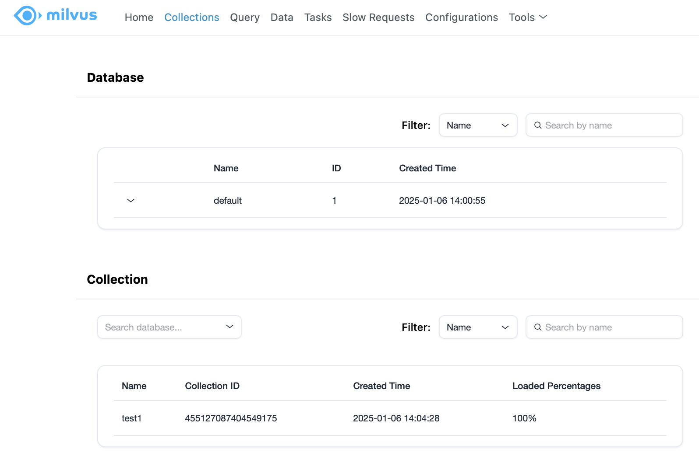

# langchain + milvus
* https://python.langchain.com/docs/integrations/vectorstores/milvus/

## Envs
* milvus db in standalone mode
    * docker `milvusdb/milvus:v2.5.2` image
    * https://milvus.io/docs/install_standalone-docker.md

## Data
* webui is provided
