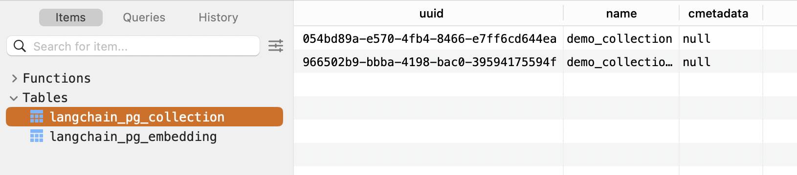
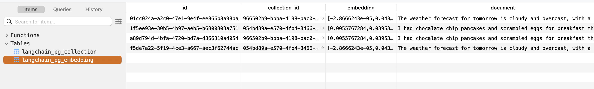

# langchain + pgvector
* analyze how db schema in constructed under the hood when using langchain + pgvector

## Envs
* db: pgvector
    * `pgvector/pgvector:pg16` docker image
    * https://python.langchain.com/docs/integrations/vectorstores/pgvector/
    * https://github.com/pgvector/pgvector
* 추가 설치
    * psycopg[binary,pool], langchain_postgres
    * brew install libpq

## DB Schema
* langchain combines all 'collections' rows into 2 tables
    * https://github.com/langchain-ai/langchain/issues/6045
    * `langchain_pg_collection`, `langchain_pg_embedding`

### langchain_pg_collection

```
CREATE TABLE "public"."langchain_pg_collection" (
    "uuid" uuid NOT NULL,
    "name" varchar NOT NULL,
    "cmetadata" json,
    PRIMARY KEY ("uuid")
);
CREATE UNIQUE INDEX langchain_pg_collection_name_key ON public.langchain_pg_collection USING btree (name);
```
* `langchain_pg_collection_name_key`
    * ensures 'name' has unique values
    * Unique Index (B-tree)

### langchain_pg_embedding

```
CREATE TABLE "public"."langchain_pg_embedding" (
    "id" varchar NOT NULL,
    "collection_id" uuid,
    "embedding" vector,
    "document" varchar,
    "cmetadata" jsonb,
    CONSTRAINT "langchain_pg_embedding_collection_id_fkey" FOREIGN KEY ("collection_id") REFERENCES "public"."langchain_pg_collection"("uuid") ON DELETE CASCADE,
    PRIMARY KEY ("id")
);
CREATE INDEX ix_cmetadata_gin ON public.langchain_pg_embedding USING gin (cmetadata jsonb_path_ops);
CREATE UNIQUE INDEX ix_langchain_pg_embedding_id ON public.langchain_pg_embedding USING btree (id);
```
* `ix_cmetadata_gin`
    * Optimizes queries that use JSON path operations on the cmetadata column
        * particularly useful for efficiently querying nested or complex structures in JSONB data.
    * GIN (Generalized Inverted Index)
* `ix_langchain_pg_embedding_id`
    *  Ensures that the id column in the langchain_pg_embedding table has unique values
    * speeds up searches and ensures no two embeddings have the same id
    * Unique Index (B-tree)
* `ix_embedding_vector`
    * 
## Retrieval by DB access
* use sqalchemy to search from pgvector db directly
* `cosine_distance` can be replaced with something else
```
# Define the Model
class LangChainEmbedding(Base):
    __tablename__ = "langchain_pg_embedding"

    id = Column(String, primary_key=True)
    collection_id = Column(UUID, ForeignKey("langchain_pg_collection.uuid"))
    embedding = Column(Vector(1024))  # Replace 1536 with your embedding dimension
    document = Column(String)
    cmetadata = Column(JSON)

    # Index for vector similarity
    __table_args__ = (
        Index("ix_embedding_vector", "embedding", postgresql_using="ivfflat"),
    )

class LangChainCollection(Base):
    __tablename__ = "langchain_pg_collection"

    uuid = Column(UUID(as_uuid=True), primary_key=True, default=uuid.uuid4, nullable=False)
    name = Column(String, unique=True, nullable=False)
    cmetadata = Column(JSON, nullable=True)

    __table_args__ = (
        Index("langchain_pg_collection_name_key", "name", unique=True),
    )

    def __repr__(self):
        return f"<LangChainCollection(uuid={self.uuid}, name={self.name}, cmetadata={self.cmetadata})>"

from typing import List, Optional, Dict, Sequence, Any
from sqlalchemy.sql import asc
from sqlalchemy import Float
from sqlalchemy import cast
from sqlalchemy.dialects.postgresql import JSONB

class VectorSearchService:
    def __init__(self, session_factory, embedding_store, collection_store):
        """
        Initialize the service.
        Args:
            session_factory: A function or context manager that provides a database session.
            embedding_store: The SQLAlchemy model for the embedding table.
            collection_store: The SQLAlchemy model for the collection table.
        """
        self._make_sync_session = session_factory
        self.EmbeddingStore = embedding_store
        self.CollectionStore = collection_store
    
    def _create_filter_clause(self, filters: Dict[str, str]):
        """
        Create a filter clause for JSONB fields.
        Args:
            filters: A dictionary of filters to apply.
        Returns:
            SQLAlchemy binary expression for filtering.
        """
        return cast(self.EmbeddingStore.cmetadata, JSONB).op("@>")(cast(filters, JSONB))

    def distance_strategy(self, embedding: List[float]):
        """
        Return the distance metric to use for vector similarity.
        Args:
            embedding (list): Query vector for similarity search.
        Returns:
            SQL expression for the distance metric.
        """
        return self.EmbeddingStore.embedding.cosine_distance(embedding)

    def query_collection(
        self,
        embedding: List[float],
        k: int = 4,
        filter: Optional[Dict[str, str]] = None,
    ) -> Sequence[Any]:
        """
        Query the collection for the most similar embeddings.
        Args:
            embedding (list): The query embedding.
            k (int): Number of results to retrieve.
            filter (dict, optional): Filters to apply on metadata.
        Returns:
            List of results with similarity scores.
        """
        with self._make_sync_session() as session:
            # Ensure the collection exists
            collection = session.query(self.CollectionStore).first()
            if not collection:
                raise ValueError("Collection not found")

            # Create filter conditions
            filter_by = [self.EmbeddingStore.collection_id == collection.uuid]
            if filter:
                filter_clause = self._create_filter_clause(filter)
                if filter_clause is not None:
                    filter_by.append(filter_clause)

            # Query embeddings with similarity search
            results: List[Any] = (
                session.query(
                    self.EmbeddingStore,
                    self.distance_strategy(embedding).label("distance"),
                )
                .filter(*filter_by)
                .order_by(asc("distance"))
                .limit(k)
                .all()
            )

        return results

service = VectorSearchService(sessionmaker(bind=engine), LangChainEmbedding, LangChainCollection)

# Query for similar embeddings
query_vector = [0.1] * 1024  # Example query vector
results = service.query_collection(embedding=query_vector, k=5, filter={"source": "tweet"})

# Print results
for result in results:
    embedding, distance = result
    print(f"ID: {embedding.id}, Distance: {distance}, Document: {embedding.document}")

->
1024
ID: f5de7a22-5f19-4ce3-a667-aec3f62744ac, Similarity: 3.3730622839561906, Document: The weather forecast for tomorrow is cloudy and overcast, with a high of 62 degrees.
ID: 30a011d9-aabd-425b-a2f8-09fa3e203c1b, Similarity: 3.3730622839561906, Document: The weather forecast for tomorrow is cloudy and overcast, with a high of 62 degrees.
ID: 1f5ee93e-30b5-4b97-aeb5-b6800303a751, Similarity: 3.380812549321885, Document: I had chocalate chip pancakes and scrambled eggs for breakfast this morning.
ID: c332e63d-fc81-402c-bf62-99418a4d1345, Similarity: 3.380812549321885, Document: I had chocalate chip pancakes and scrambled eggs for breakfast this morning.
```

