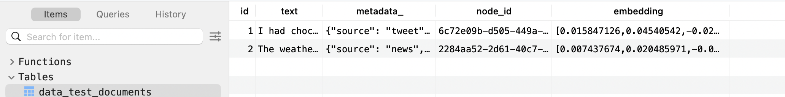

# llamaindex + pgvector
* analyze how db schema in constructed under the hood when using llamaindex + pgvector

## Envs
* `pgvector/pgvector:pg16` docker image

## DB Schema
* data tables are created once documents are inserted
    * creates **separate** table for each collection
* table name: `data_{table_name}`
    * `table_name` is provided when initializing `PGVectorStore`

### data_{table_name}

```
CREATE SEQUENCE IF NOT EXISTS data_test_documents_id_seq;

CREATE TABLE "public"."data_test_documents" (
    "id" int8 NOT NULL DEFAULT nextval('data_test_documents_id_seq'::regclass),
    "text" varchar NOT NULL,
    "metadata_" json,
    "node_id" varchar,
    "embedding" vector,
    PRIMARY KEY ("id")
);

CREATE INDEX data_test_documents_embedding_idx ON public.data_test_documents USING hnsw (embedding vector_cosine_ops) WITH (m='16', ef_construction='64');
```
* uses `id` and `node_id` separately
* `data_test_documents_embedding_idx` index
    * index on the embedding column to optimize similarity search
    * uses hnsw (hirearchical navigable small world) algorithm provided by pgvector
    * `vector_cosine_ops`: specity cosine distance for similarity metric
    * `m`, `ef_construction`: hnsw parameters

metadata column:
* https://github.com/run-llama/llama_index/issues/3371
```
{
    "source": "tweet",
    "_node_content": "{\"id_\": \"6c72e09b-d505-449a-9e64-e7dba419382f\", \"embedding\": null, \"metadata\": {\"source\": \"tweet\"}, \"excluded_embed_metadata_keys\": [], \"excluded_llm_metadata_keys\": [], \"relationships\": {\"1\": {\"node_id\": \"41a331b4-58aa-4ad2-a24c-3a6662863167\", \"node_type\": \"4\", \"metadata\": {\"source\": \"tweet\"}, \"hash\": \"c211cf902096529c230ab1394516787d54390c9228e4f376fa12fa2c9699a6d9\", \"class_name\": \"RelatedNodeInfo\"}}, \"metadata_template\": \"{key}: {value}\", \"metadata_separator\": \"\\n\", \"text\": \"\", \"mimetype\": \"text/plain\", \"start_char_idx\": 0, \"end_char_idx\": 76, \"metadata_seperator\": \"\\n\", \"text_template\": \"{content}\", \"class_name\": \"TextNode\"}",
    "_node_type": "TextNode",
    "document_id": "41a331b4-58aa-4ad2-a24c-3a6662863167",
    "doc_id": "41a331b4-58aa-4ad2-a24c-3a6662863167",
    "ref_doc_id": "41a331b4-58aa-4ad2-a24c-3a6662863167"
}
```
* `source`: metadata key used by example
* `_node_content`:
* `document_id`
* `doc_id`
* `ref_doc_id`

## Experiments
### Manually creating table & inserting via llama-index
* create collection'test_documents' manually
* need to put `CREATE EXTENSION vector;` during initialization
    * gives error `type "vector" does not exist` without it
* must manually set hnsw option params (m, ef_construction)
```
CREATE EXTENSION vector;
CREATE SEQUENCE IF NOT EXISTS data_test_documents_id_seq;

CREATE TABLE "public"."data_test_documents" (
    "id" int8 NOT NULL DEFAULT nextval('data_test_documents_id_seq'::regclass),
    "text" varchar NOT NULL,
    "metadata_" json,
    "node_id" varchar,
    "embedding" vector(1024),
    PRIMARY KEY ("id")
);

CREATE INDEX data_test_documents_embedding_idx ON public.data_test_documents USING hnsw (embedding vector_cosine_ops) WITH (m='16', ef_construction='64');
```