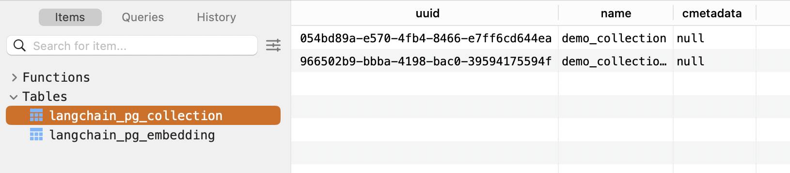
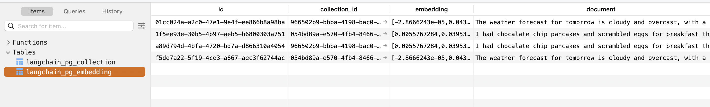

# langchain + pgvector
* analyze how db schema in constructed under the hood when using langchain + pgvector

## Envs
* `pgvector/pgvector:pg16` docker image

## DB Schema
* langchain combines all 'collections' rows into 2 tables
    * https://github.com/langchain-ai/langchain/issues/6045
    * `langchain_pg_collection`, `langchain_pg_embedding`

### langchain_pg_collection

```
CREATE TABLE "public"."langchain_pg_collection" (
    "uuid" uuid NOT NULL,
    "name" varchar NOT NULL,
    "cmetadata" json,
    PRIMARY KEY ("uuid")
);
CREATE UNIQUE INDEX langchain_pg_collection_name_key ON public.langchain_pg_collection USING btree (name);
```
* `langchain_pg_collection_name_key`
    * ensures 'name' has unique values
    * Unique Index (B-tree)

### langchain_pg_embedding

```
CREATE TABLE "public"."langchain_pg_embedding" (
    "id" varchar NOT NULL,
    "collection_id" uuid,
    "embedding" vector,
    "document" varchar,
    "cmetadata" jsonb,
    CONSTRAINT "langchain_pg_embedding_collection_id_fkey" FOREIGN KEY ("collection_id") REFERENCES "public"."langchain_pg_collection"("uuid") ON DELETE CASCADE,
    PRIMARY KEY ("id")
);
CREATE INDEX ix_cmetadata_gin ON public.langchain_pg_embedding USING gin (cmetadata jsonb_path_ops);
CREATE UNIQUE INDEX ix_langchain_pg_embedding_id ON public.langchain_pg_embedding USING btree (id);
```
* `ix_cmetadata_gin`
    * Optimizes queries that use JSON path operations on the cmetadata column
        * particularly useful for efficiently querying nested or complex structures in JSONB data.
    * GIN (Generalized Inverted Index)
* `ix_langchain_pg_embedding_id`
    *  Ensures that the id column in the langchain_pg_embedding table has unique values
    * speeds up searches and ensures no two embeddings have the same id
    * Unique Index (B-tree)
* `ix_embedding_vector`
    * 
## Retrieval by DB access
* use sqalchemy to search from pgvector db directly
* `cosine_distance` can be replaced with something else
```
# Define the Model
class LangChainEmbedding(Base):
    __tablename__ = "langchain_pg_embedding"

    id = Column(String, primary_key=True)
    collection_id = Column(UUID, ForeignKey("langchain_pg_collection.uuid"))
    embedding = Column(Vector(1024))  # Replace 1536 with your embedding dimension
    document = Column(String)
    cmetadata = Column(JSON)

    # Index for vector similarity
    __table_args__ = (
        Index("ix_embedding_vector", "embedding", postgresql_using="ivfflat"),
    )

# Perform Similarity Search
def search_similar_embeddings(query_vector, collection_id, top_k=5):
    """
    Perform similarity search on the langchain_pg_embedding table.
    Args:
        query_vector (list): The query embedding vector.
        collection_id (str): The UUID of the collection to search within.
        top_k (int): Number of top results to return.
    Returns:
        list: List of matching rows with similarity scores.
    """
    with Session() as session:
        # SQLAlchemy query
        stmt = (
            select(
                LangChainEmbedding.id,
                LangChainEmbedding.document,
                LangChainEmbedding.cmetadata,
                LangChainEmbedding.embedding.cosine_distance(query_vector).label("similarity")
            )
            .where(LangChainEmbedding.collection_id == collection_id)
            .order_by("similarity")
            .limit(top_k)
        )

        results = session.execute(stmt).fetchall()

    # Parse results
    return [
        {
            "id": row.id,
            "document": row.document,
            "cmetadata": row.cmetadata,
            "similarity": row.similarity,
        }
        for row in results
    ]

query_vector = [0.1]*1024
print(len(query_vector))
collection_id = "054bd89a-e570-4fb4-8466-e7ff6cd644ea"  # Replace with your collection UUID
results = search_similar_embeddings(query_vector, collection_id)

# Print results
for result in results:
    print(f"ID: {result['id']}, Similarity: {result['similarity']}, Document: {result['document']}")

->
1024
ID: f5de7a22-5f19-4ce3-a667-aec3f62744ac, Similarity: 3.3730622839561906, Document: The weather forecast for tomorrow is cloudy and overcast, with a high of 62 degrees.
ID: 30a011d9-aabd-425b-a2f8-09fa3e203c1b, Similarity: 3.3730622839561906, Document: The weather forecast for tomorrow is cloudy and overcast, with a high of 62 degrees.
ID: 1f5ee93e-30b5-4b97-aeb5-b6800303a751, Similarity: 3.380812549321885, Document: I had chocalate chip pancakes and scrambled eggs for breakfast this morning.
ID: c332e63d-fc81-402c-bf62-99418a4d1345, Similarity: 3.380812549321885, Document: I had chocalate chip pancakes and scrambled eggs for breakfast this morning.
```

