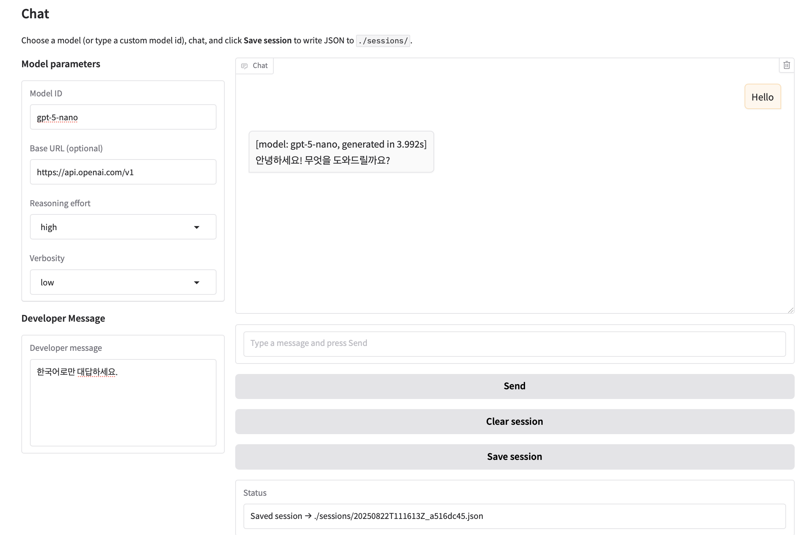

# [2025.08] Simple LLM Chat


Features
- multi-turn chat conversation
- Uses OpenAI compatible Chat Completion
    - applies system-based reasoning effort for gpt-oss
- Saves conversation history as json

Session History JSON example
```
{
  "saved_at": "2025-08-22T04:27:46.009580Z",
  "history": [
    {
      "role": "user",
      "text": "Hi!",
      "time": "2025-08-22T04:27:43.370488Z"
    },
    {
      "role": "assistant",
      "text": "안녕하세요! 무엇을 도와드릴까요?",
      "time": "2025-08-22T04:27:44.612603Z",
      "gen_time_s": 1.241889,
      "model": "gpt-5-nano"
    }
  ]
}
```