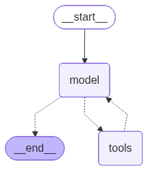

# Langchain (LangGraph) Agent
[LangGraph (LangChain Agent)](https://docs.langchain.com/oss/python/langgraph/overview)

## 프레임워크 파악
framework and runtime for building, managing, and deploying long-running, stateful agents
- you don’t need to use LangChain to use LangGraph

핵심 기능
- Memory 기능
- LangSmith 연동을 통한 시각화, 디버깅
    - execution path, state transition
    - 이슈: enterprise로만 제공

### Graph vs Functional
LangGraph에서 agent는 2가지 개념으로 정의 가능
- Graph API: 명시적인 그래프 (노드, 엣지)로 동작 흐름 정의
- Functional API: 함수 처럼 정의, 1개의 함수 내에 흐름 정의
    - you write standard control flow logic (loops, conditionals) within a single function.
    - entrypoint, task decorator로 LangGraph 기능을 얹는 방식

Graph는 흐름을 '선언', Functional은 흐름을 직접 '코딩'

langchain.agents의 `create_agent` 함수를 사용할 경우 Graph API로 선언된 에이전트가 정의됨
- create_agent 내부에서 StateGraph 생성, compile 후 반환함
- 참고) 예전에는 `create_react_agent`라는 명칭으로 사용했음 (react: reason -> act)


## 구현 기초
### Client 선언
사용할 LLM provider에 해당되는 Client를 선언
- BaseChatModel을 상속하는 클래스 ([langchain_core.language_models.chat_models.BaseChatModel](https://github.com/langchain-ai/langchain/blob/b0041037213ea9fde193d339c6cc654f6b2a25c4/libs/core/langchain_core/language_models/chat_models.py#L246))

OpenAI compatible 모델의 경우 2가지 방법으로 가능
- ChatOpenAI에 base_url 제공
- ChatOpenAI에 AsyncOpenAI 직접 선언해서 제공

방법1:
```
from langchain_openai import ChatOpenAI
ChatOpenAI(
    base_url="http://.../v1",
    api_key="sk-...",
    model="Qwen..."
)
```

방법2:
- AsyncOpenAI 클라이언트가 아니라 [AsyncCompletions](https://github.com/openai/openai-python/blob/3e0c05b84a2056870abf3bd6a5e7849020209cc3/src/openai/resources/chat/completions/completions.py#L1544) 객체 제공 필요
```
ChatOpenAI(
    async_client=AsyncOpenAI(
        base_url="http://.../v1",
        api_key="sk-...",
    ).chat.completions
    model="Qwen..."
)
```

### MCP Tool 연결
[langchain-mcp-adapters](https://github.com/langchain-ai/langchain-mcp-adapters) 패키지의 [MultiServerMCPClient]()에 설정값을 넘긴 후 get_tools로 사용 가능 tool을 조회
- init에 connections (Dict[str, Connection])제공 필요
    - [Connection](https://github.com/langchain-ai/langchain-mcp-adapters/blob/main/langchain_mcp_adapters/sessions.py#L186) (TypedDict): StdioConnection | SSEConnection | StreamableHttpConnection | WebsocketConnection
- tool은 각각 langchain_core.tools.StructuredTool 객체

connections 정의:
```
mcp_connections = {}
mcp_connections["location"] = StreamableHttpConnection(
    transport="streamable_http",
    url=settings.location_mcp.url,
    headers={"x-user-id": user_id},
    timeout=60
)

mcp_connections["weather"] = StreamableHttpConnection(
    transport="streamable_http",
    url=settings.weather_mcp.url,
    timeout=60
)
```

tool 조회:
```
mcp_client = MultiServerMCPClient(mcp_connections)
tools = await mcp_client.get_tools()
-> List[StructuredTool]
```


### Agent (Graph) 선언
langchain.agents.create_agent 함수를 통해 에이전트 그래프를 선언
- compile된 CompiledStateGraph 인스턴스를 반환

```
graph = create_agent(
    model=llm_client,
    tools=tools,
    system_prompt=AGENT_INSTRUCTION,
    name="WeatherAgent"
)
```

위 그래프의 흐름은 아래 그림과 같다
- tool_calls가 있다면 tools 노드로, 없다면 (빈 리스트) 종료


### Agent Response
graph.invoke 실행 결과는 {"messages": [...]} 형태의 메시지 히스토리이다.

실행 결과 예시
```
# 사람 요청
MSG 0 - <class 'langchain_core.messages.human.HumanMessage'>
	[{'type': 'text', 'text': '내 현재 위치와 주변 도시들을 알려주고 그 도시들의 날씨들도 알려줘.'}]

...

# LLM의 tool calling 호출 (N개 동시)
MSG 5 - <class 'langchain_core.messages.ai.AIMessage'>
	'서울 주변 도시로는 성남, 수원, 창원이 있습니다. 각 도시의 날씨를 확인해 보겠습니다.\n\n\n'
	tools:[
        {'name': 'get_current_weather', 'args': {'city_name': 'Seoul'}, 'id': 'chatcmpl-tool-976148af4f6b7f98', 'type': 'tool_call'},
        ...,
        {'name': 'get_current_weather', 'args': {'city_name': 'Changwon'}, 'id': 'chatcmpl-tool-9f1820c30766cc33', 'type': 'tool_call'}
    ]

# MCP의 tool 호출 결과 (각각 별도의 메시지)
MSG 6 - <class 'langchain_core.messages.tool.ToolMessage'>
	[{'type': 'text', 'text': '{"time":"20260218-22:00","status":{"temp_cel":3,"condition":"맑음","humidity_pct":58,"wind_kph":11}}', 'id': 'lc_bbf6feb1-8b4c-4e42-8687-03976d1d9d20'}]
...
MSG 9 - <class 'langchain_core.messages.tool.ToolMessage'>
	[{'type': 'text', 'text': '{"time":"20260218-22:00","status":{"temp_cel":6,"condition":"구름 조금","humidity_pct":56,"wind_kph":11}}', 'id': 'lc_0e65c63d-b3bb-4393-a91f-cd1a099e49d8'}]

# LLM 취합 결과
MSG 10 - <class 'langchain_core.messages.ai.AIMessage'>
	'현재 위치와 주변 도시의 날씨 정보를 확인했습니다.\n\n- **서울**: 3°C, 맑음, 습도 58%, 바람 11km/h  \n- **성남**: 2°C, 구름 많음, 습도 54%, 바람 9km/h  \n- **수원**: 1°C, 맑음, 습도 49%, 바람 9km/h  \n- **창원**: 6°C, 구름 조금, 습도 56%, 바람 11km/h  \n\n추운 날씨이니, 따뜻하게 입으시고 건강 조심하세요!'
	tools:[]
```

## Agent 실행 예시
### Graph 입력
messages 형식으로 제공
- Chat Completion 형식의 메시지 (ChatOpenAI를 쓰고 있으므로) 형태
- 각 메시지는 딕셔너리 / langchain의 Message 클래스 가능

딕셔너리
```
messages = [
    {
        "role": "user",
        "content": [
            {"type": "text", "text": query}
        ]
    }
]
```

langchain의 Message
```
messages = [
    HumanMessage(content=query)
]
```


### invoke (결과 한번에 받기)
invoke: compile 된 그래프를 실행

```
result = await graph.ainvoke({"messages": messages})
```

### astream (스트리밍으로 받기)
astream의 stream_mode 따라서 받는 내용이 다름
- https://docs.langchain.com/oss/python/langgraph/streaming
- 'updates'의 경우 state의 업데이트 내용을 받음

```
result_stream = graph.astream(
    {"messages": messages},
    stream_mode="updates"
)

async for chunk in result_stream:
    # chunk는 key가 node 명칭, value가 {'messages': [...]} 형태의 dict
    for node, data in chunk.items():
        if node=='model':
            # tool_call 요청
            ...
        elif node=='tools':
            # tool_result 결과
            ...
```