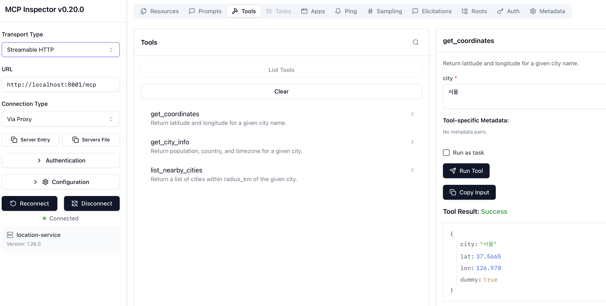

# mcp servers
2 MCP Servers with dummy tools
- server_location: location related tools
- server_weather: weather related tools

Run servers like
```
# location mcp
uvicorn server_location:app --host 0.0.0.0 --port 8002

# weather mcp
uvicorn server_weather:app --host 0.0.0.0 --port 8002
```

## Servers
### server_location
`get_user_location()`
- 사용자의 현재 정보를 도시명 + 좌표로 전달
- header에 유저 정보를 넣어서 인식
  - 주의! - 보안상 좋지 않음, 데모 사용 케이스에 대해서 처리

```
Input: {}
Output: {"name": "Seoul", "coordinate": {"lat": 37.5665, "lon": 126.978}}
```

`get_nearby_cities(city_name: str, n: int = 3)`
- Returns nearby cities to a given city

```
Input: {"city_name": "Seoul", "n": 3}
Output:
[
  {"name": "Busan", "coordinate": {"lat": 35.1796, "lon": 129.0756}},
  {"name": "Suwon", "coordinate": {"lat": 37.2636, "lon": 127.0286}},
  {"name": "Seongnam", "coordinate": {"lat": 37.4200, "lon": 127.1267}}
]
```

### server_weather
`get_current_weather(city_name: str)`
- Returns current weather for a city

```
Input: {"city_name": "Seoul"}
Output:
{
  "time": "20260217-14:00",
  "status": {
    "temp_cel": 3,
    "condition": "맑음",
    "humidity_pct": 55,
    "wind_kph": 12
  }
}
```

`get_weather_forecast(city_name: str, days: int = 3)`
- Returns weather forecast for a city

```
Input: {"city_name": "Seoul", "days": 3}
Output:
[
  {
    "time": "20260217",
    "status": {
      "temp_cel": 2,
      "condition": "맑음",
      "humidity_pct": 55,
      "wind_kph": 12
    }
  },
  {
    "time": "20260218",
    ...
  },
  ...  
]
```

## MCP Inspector
We can use [mcp inspector](https://github.com/modelcontextprotocol/inspector) to test tools

