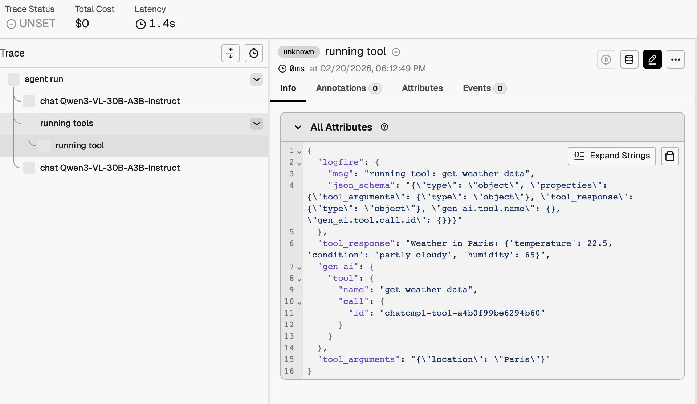
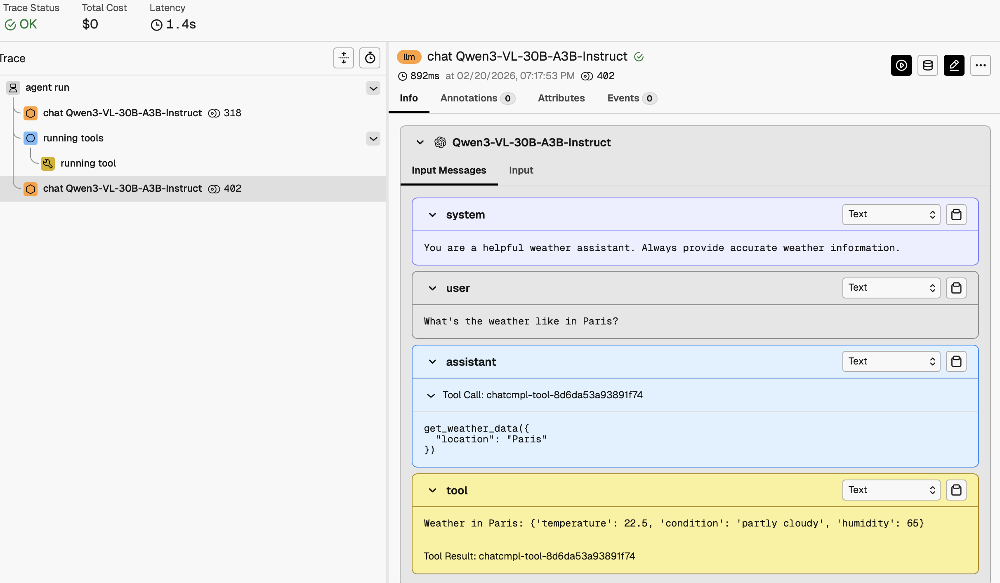

# Arize Phoenix

## 트레이싱 결과 예시
트레이싱 (Tool Call)


기록된 messages


## phoenix 서버 세팅
Docker 이미지 `arizephoenix/phoenix` 사용, docker-compose로 띄움
- 공식 가이드 [[링크]](https://arize.com/docs/phoenix/self-hosting/deployment-options/docker)
- 테스트는 sqlite db 연동으로 진행

```
services:
  phoenix:
    image: arizephoenix/phoenix:latest # Must be greater than 4.0 version to work
    ports:
      - 9041:6006  # PHOENIX_PORT
      - 4317:4317  # PHOENIX_GRPC_PORT
    environment:
      - PHOENIX_WORKING_DIR=/mnt/data
    volumes:
      - phoenix_data:/mnt/data   # PHOENIX_WORKING_DIR
volumes:
  phoenix_data:
    driver: local
```

### 아키텍쳐
공식 아키텍쳐 문서 [[링크]](https://arize.com/docs/phoenix/self-hosting/architecture)
- SQLite, PostgreSQL db 지원
- sqlite의 경우 `PHOENIX_WORKING_DIR`로 지정한 위치에 저장 (기본 경로: `~/.phoenix/`)


## tracking 설정
### arize-phoenix-otel 패키지 사용
phoenix 제공 OpenTelemtry wrapper
- 실험 노트북: [phoenix-package-pydantic-ai-example.ipynb](./phoenix-package-pydantic-ai-example.ipynb)
- 공식 문서 [[링크]](https://arize.com/docs/phoenix/sdk-api-reference/python/arize-phoenix-otel)
- set_global_tracer_provider=False 세팅시 global default 세팅 방지 가능

```
from phoenix.otel import register

tracer_provider = register(
    endpoint=PHOENIX_GRPC_ENDPOINT,
    protocol="grpc",
    project_name="default",
    headers={"Authorization": "Bearer YOUR_TOKEN"},
    batch=True,
    auto_instrument=True,
)
```

### OpenTelemetry 직접 사용
OpenTelemetry 패키지를 직접 사용
- 실험 노트북: [opentelemetry-pydantic-ai-example.ipynb](./opentelemetry-pydantic-ai-example.ipynb)
- 공식 가이드: [[링크]](https://arize.com/docs/phoenix/integrations/python/pydantic/pydantic-tracing)

```
import os
from opentelemetry import trace
from opentelemetry.exporter.otlp.proto.http.trace_exporter import OTLPSpanExporter
from opentelemetry.sdk.trace import TracerProvider
from openinference.instrumentation.pydantic_ai import OpenInferenceSpanProcessor
from opentelemetry.sdk.trace.export import SimpleSpanProcessor

# Set up the tracer provider
tracer_provider = TracerProvider()
trace.set_tracer_provider(tracer_provider)

# Add the OpenInference span processor
endpoint = f"{os.environ['PHOENIX_COLLECTOR_ENDPOINT']}/v1/traces"

# If you are using a local instance without auth, ignore these headers
headers = {"Authorization": f"Bearer {os.environ['PHOENIX_API_KEY']}"}
exporter = OTLPSpanExporter(endpoint=endpoint, headers=headers)

tracer_provider.add_span_processor(OpenInferenceSpanProcessor())
tracer_provider.add_span_processor(SimpleSpanProcessor(exporter))
```