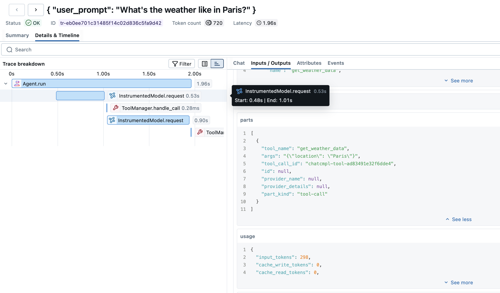
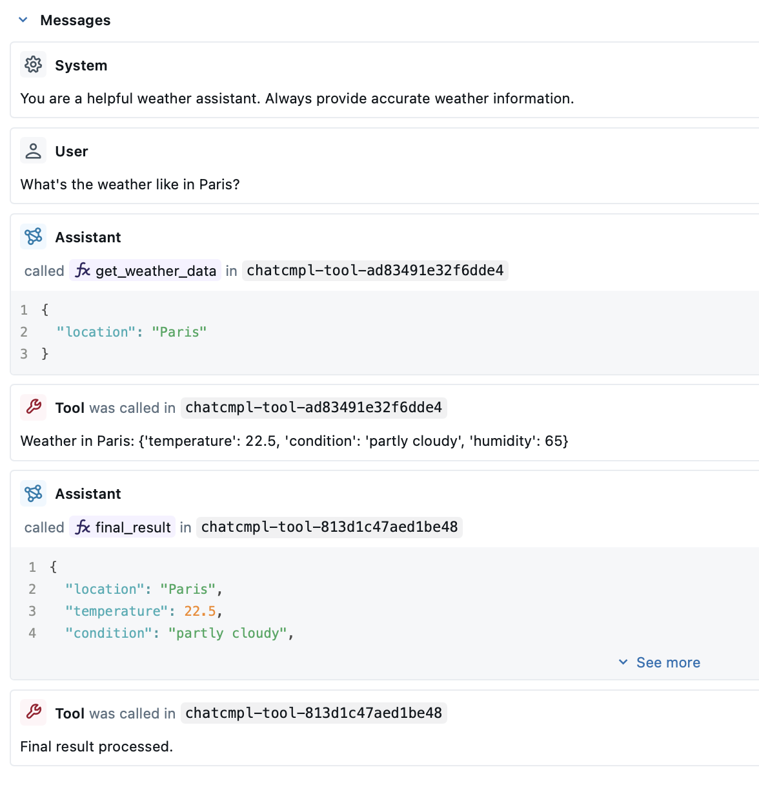

# mlflow tracing

## 트레이싱 결과 예시
트레이싱 (Tool Call)


Messages 기록



## mlflow server 세팅
로컬에서 실행 (sqlite db 사용):
- 개발용이므로 "*"로 모두 허용
```
mlflow server \
    --backend-store-uri sqlite:///mlflow.db \
    --host 0.0.0.0 \
    --port ${PORT} \
    --allowed-hosts "*" \
    --cors-allowed-origins "*"
```

### 아키텍쳐
공식 아키텍쳐 문서 [[링크]](https://mlflow.org/docs/latest/self-hosting/architecture/overview/)

저장소:
- Backend Store: stores the metadata of experiments, runs, traces, etc
    - SQLAlchemy 사용 (postgresql, mysql, sqlite and mssql)
- Artifact Store: store persists (typically large) artifacts for each run, such as model weights, images (png)
    - object storage 연동

## tracking 설정
### mlflow 패키지 사용
공식 가이드: [[링크]](https://mlflow.org/docs/latest/genai/tracing/quickstart/)

```
import mlflow

## Setup mlflow logging
# Turn on auto tracing by calling mlflow.pydantic_ai.autolog()
mlflow.pydantic_ai.autolog()

# Optional: Set a tracking URI and an experiment
mlflow.set_tracking_uri("http://localhost:9041")
mlflow.set_experiment("Default")
```

### OpenTelemetry 사용
공식 가이드: [[링크]](https://mlflow.org/docs/latest/genai/tracing/opentelemetry/ingest/)
- v3.10 기준 HTTP 방식의 OpenTelemetry 수집 제공 (>=v3.60 부터, grpc는 x)

추가적으로 Arize AI의 [`openinference`](https://github.com/Arize-ai/openinference) 패키지를 사용해서 opentelemetry 연동이 가능함
- `openinference-instrumentation-pydantic-ai` 패키지

```
from opentelemetry import trace
from opentelemetry.sdk.trace import TracerProvider
from opentelemetry.sdk.trace.export import BatchSpanProcessor
from opentelemetry.exporter.otlp.proto.http.trace_exporter import OTLPSpanExporter

from openinference.instrumentation.pydantic_ai import OpenInferenceSpanProcessor

MLFLOW_ENDPOINT = "http://localhost:9041/v1/traces"
MLFLOW_EXPERIMENT_ID = "0" # Default 

# OTel Provider 설정
provider = TracerProvider()
# openinference의 pydantic-ai processor
provider.add_span_processor(OpenInferenceSpanProcessor())
provider.add_span_processor(
    BatchSpanProcessor(
        OTLPSpanExporter(
            endpoint=MLFLOW_ENDPOINT,
            headers={"x-mlflow-experiment-id": MLFLOW_EXPERIMENT_ID},
        )
    )
)
trace.set_tracer_provider(provider)
```

Agent에 instrumentation 설정
- openinference 공식 기준은 InstrumentationSettings를 넘김
- instrument=True만 세팅해도 동작은 함
```
from pydantic_ai.models.instrumented import InstrumentationSettings

instrumentation = InstrumentationSettings(version=2)
agent = Agent(..., instrument=instrumentation)
```

