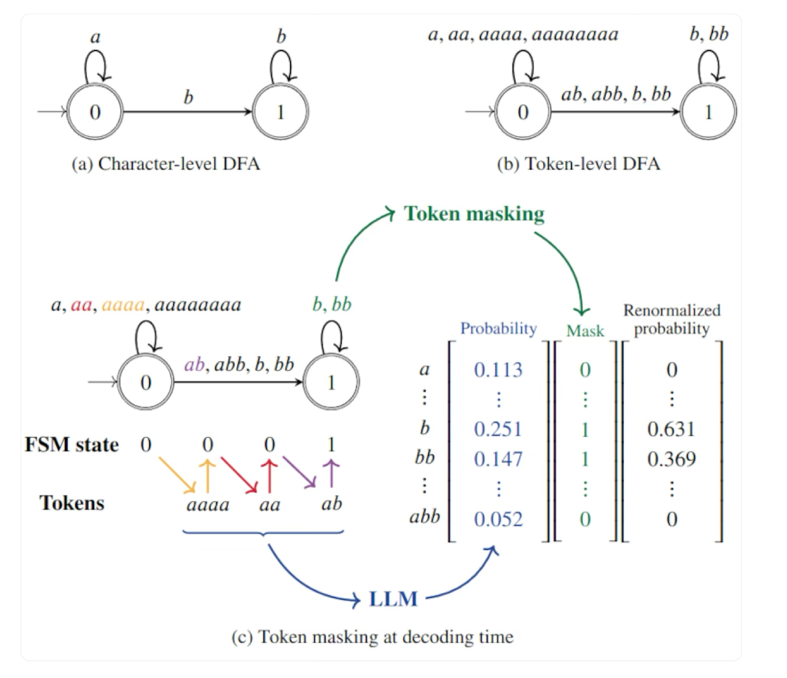
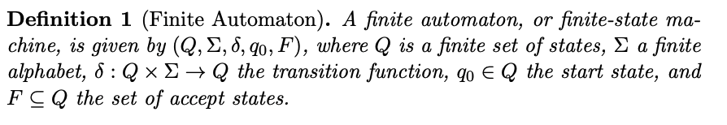
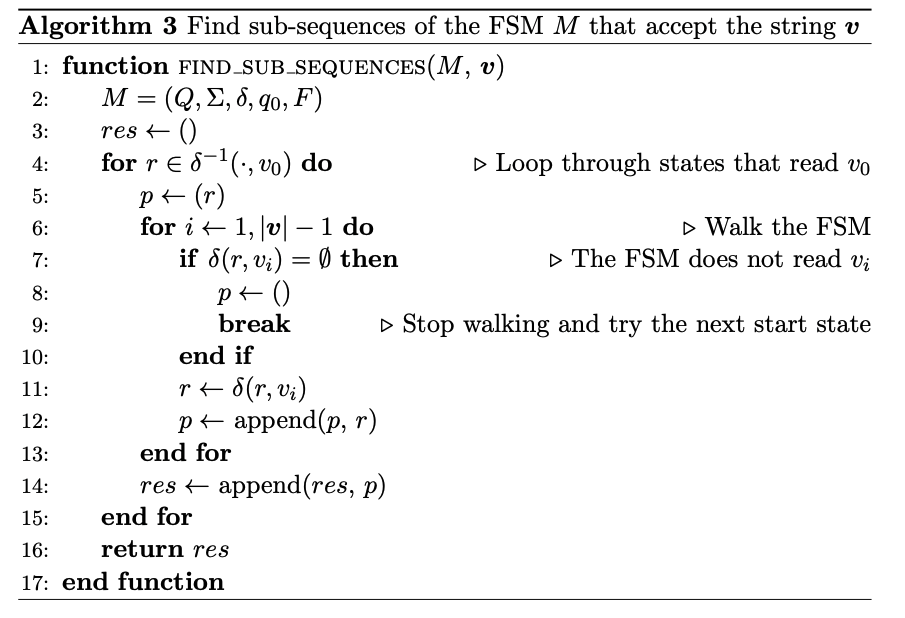
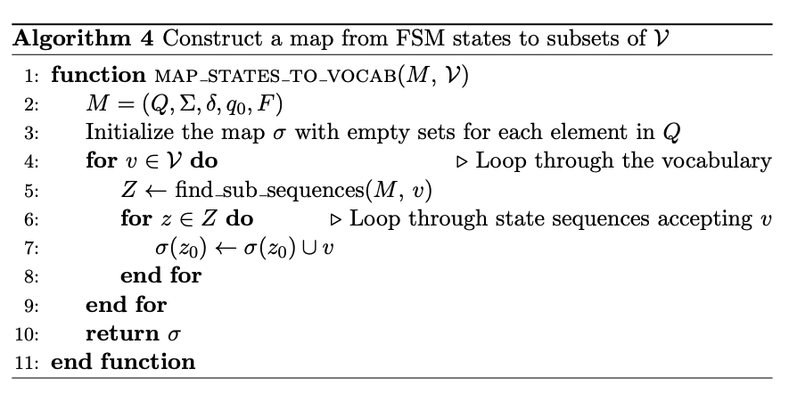

# [NLG] Outlines - Efficient Guided Generation for Large Language Models (Willard & Louf 2023)

Analysis of paper “Efficient Guided Generation for Large Language Models (Willard & Louf 2023)” [1] which describes the methodology of python Outlines[2] package.
* [1] [**Efficient Guided Generation for Large Language Models - Willard & Louf 2023**](https://arxiv.org/abs/2307.09702)
* [2] [https://github.com/outlines-dev/outlines](https://github.com/outlines-dev/outlines)

- ‘Outlines implements an efficient method that ensures compliance with an arbitrary regex’

Table of Contents

1. Introduction 
2. LLM Sampling and Guided Generation - explains masking
3. Iterative FSM Processing and Indexing - Introduces concept of interpreting next token generation as FSM transition & explains mapping valid tokens for each state
4. Extensions to Iterative Parsing - extend to using push-down automata to handle more complex grammars (ex. Python)

## 1. Introduction

- neural text generation can be **reformulated** in terms of **transitions between the states of a finite-state machine**
- present using the finite state machine (FSM) formulation of regular expressions
    - efficient approach to guide generation with regular expressions and context-free-grammars
    - by allowing the construction of an **index** over vocabulary
    - costs O(1) on average
- vocabulary indexing introduced in this paper removes a prohibitive run-time scaling barrier

Previous Approaches

- common approach evaluate repeatedly over the entire vocabulary to determine which tokens are valid
    - → entails fixed O(N) cost for each token generated

## 2. LLM Sampling and Guided Generation

Multinomial sampling: sampling from the categorical distribution defined above until the EOS token is found

### 2-2. Guiding Generation

(Figure from [[3]](https://www.notion.so/NLG-Outlines-Efficient-Guided-Generation-for-Large-Language-Models-Willard-Louf-2023-beda791d50854f0fb6438fd9f619305c?pvs=21))



- dealing with a finite, discrete distribution
- compute un-normalized conditional distribution by applying **boolean mask** (m)
    - mask (m) out **un-normalized logit values** of unsuitable tokens
    - computation of m is implicitly performed over all elements of Vocab
    - m will necessarily depend on previously sampled tokens
- Guided generation is ultimately an iterative matching / parsing problem
- How can we efficiently match or parse **incomplete** strings according to regular expression or CFG?

## 3. Iterative FSM Processing and Indexing

- Frame regular expression guided generation in terms of **state machines**
    - allows us to specify how regular expression matching can be arbitrarily started and stops
        - → match ‘incomplete’ strings
    - allows masks computation without run-time eval over vocab


- Q: finite set of states
- Σ: finite alphabet
- δ: transition function (state -alphabet→ state)
- q0: start state
- F: set of accept states (subset of Q)

Characters comprising the strings (tokens) in Vocab are drawn from Σ (alphabet)

Preprocess the Vocab using the regular expression’s FSM and build an index

- index **valid next transition** given current state
- consider starting in **every** viable FSM state
    - we need to match ‘**incomplete**’ strings
    - because string in vocab **could match arbitrary parts of a regular expression** ← implicitly FSM states



Procedure for producing matches starting at any point in the FSM

- result: list of **sub-sequences** detailing the **states through which the FSM would traverse** when accepting the provided string
    - valid paths given the current state
- Algorithm 3:
    - Given FSM M and string v (from Vocab)
    - Loop through states that **read** v_0 (r in δ^-1(.,v_0))
        - ‘read’: ability of FSM to **process or consume** input symbol
        - ‘read v_0’: State where **S-v_0→S’ is possible**, the ‘reading’ state has transition ‘v_0’
    - for each state r
        - for i in range(1, |v|-1) ← **walk** the FSM
            - if no transition to v_i → break
            - else continue
    - only append to result if **fully walked** to |V|-1 (has valid path)



Construction of map σ : Q →P(V)

- index the vocab → {state: set of allowed vocabs}
- Algorithm 4 iterates through all possible vocabs
- time-wise:
    - using hash-map → only cost O(1) on avg
    - runtime cost is irrelevant since map is constructed outside the token sampling
- memory-wise:
    - theoretically requires memory equal to number of states in FSM (|Q|)
    - but not every string in vocab will be accepted by FSM & not every FSM state will be represented by string in Vocab

### 3-2. Comparison with current methods

vs Guidance library

- partial regular expression matching applied from start of samples sequenece each time & must iterate over LLM’s vocabulary on each step
- time increases linearly when tokens increase

## 4. Extensions to Iterative Parsing

- general parser-guided generation
- example with python-like grammar provided as CFG
    - terminal symbols (DEF,NAME, ..)
        - ‘terminal’ because they don’t lead to further production rules
        - once terminal symbol is derived, no further substitution/transformations of that symbol are possible within the grammar

ex. `def foo(): pass`

- if `def f` is parsed traditionally → would return DEF, NAME
    - misidentifies `f` as ‘complete’ NAME token
- next valid strings that can be sampled from vocab
    - Case 1: continue expanding, advancing NAME
        - ‘f’ can be seen as a partially matched NAME
    - Case 2: anything that begins with “(“ (LPAR - left parentheses)
- regex for NAME can be represented by an FSM with 3 states
    - 0: initial
    - 1: [^\W\d] ← condition for first character of NAME
    - 2: \w*
- with algorithm 3, we would obtain transitions (0,1), (1,2), (2,2) for ‘f’
    - → tell us that matching can start for this vocab strin in states 0,1,2 and end in states 1,2
- next valid vocab strings are at least ‘d’, ‘ef’, ‘pass’, ‘ ‘, ‘oo(’
    - last one would progress the pare state to one that reads LPAR
    - algorithm 4 would map FSM states 0,1,2 to the subset ‘d’, ‘ef’, ‘pass’, ‘ ‘, ‘oo(’ for the symbol NAME

This illustration **omits** the underlying parser states that determine **which grammar symbols and transitions are allowed**

- if NAME was expanded with ‘oo(’ → this would **progress the parse state** to read an LPAR
    - FSM of NAME would have terminated → transition to a state accepting LPAR is allowed (by the grammar)
    - ← “transition to a state accepting LPAR” is omitted when only considering FSM (? ← not sure if I understood correctly)
- Use pushdown automata (PDA) as means to extend the FSM approach

### 4-1. Pushdown Automata Formulation

Extend FSM approach to handle more complex grammars using pushdown automata (PDA)

- parser’s PDA state aligns with FSM states of the regular expression defining a specific token → enable **efficient guided generation**

pushdown automata definition

- finite automata: can be used to accept only **regular languages**
- pushdown automata: finite automata with **extra memory called stack**

Transitions in PDA

- defined by current state (PDA state), input symbol (terminal symbol), top stack symbol (stack values)
    - stack symbols enable PDA to recognize context-free languages (FSM can’t do this on their own)
- transition function maps these to a **new state and stack operation**
    - transition_function δ = {parser_configuration: new_state+stack_operation}

Parser configurations

- consist of PDA states, corresponding FSM states, potential terminal symbols
- determined by applying Algorithm 3 to strings in vocab
    - like finding a state that reads v_0, find **stack value g** that reads PDA state q & terminal symbol v
    - stack value are needed to find paths through PDA that allows successful parses of each string in V starting from their possible parser configurations
- parser’s PDA state aligns with FSM states of the regular expression defining a specific token → enable efficient guided generation
    - ex. PDA state: NAME, FSM State: regex matching

**Indexing Approach**
- Utilize the connection between CFG’s symbols and lexing & scanning steps
    - list of CFG’s terminal symbols can be constructed for each parse/PDA state based on symbol & stack transitions allowed by the map
    - CFG (context-free-grammar) use 2 finite alphabets: terminal symbols and non-terminal symbols
        - ‘terminal’ because they don’t lead to further production rules
            - once terminal symbol is derived, no further substitutions, transformations of that symbol are possible within the grammar
        - non-terminal: symbol that can be further expanded, replaced by sequence of other sylbols
            - ‘non-’ have not yet reached final, terminal state
            - parsing process continues until all non-terminals have been replaced by terminals
- → can construct an FSM for each parse state
    - union of each FSM corresponding to a terminal symbol
    - ex. ‘NAME’ FSM + ‘DEF’ FSM, ..

- Step1: Scanning Step identifies set of **possible** (CFG) terminal symbols V’
    - for characters read since the last ‘fully identified’ symbol
    - ex. in initial state q_0 of PDA for Python like CFG
        - ‘de’ → V’ = {DEF, NAME}
        - DEF: any vocab string completing the string ‘def’
        - NAME: ano other strings read by NAME FSM
- Step2: determine **parser configurations**
    - parser configurations: consist of **PDA states, corresponding FSM states, potential terminal symbols**
        - ‘corresponding’ example (gpt-4o)
            
            ```jsx
            - Consider a Python-like grammar with a terminal symbol NAME defined by the regular expression `[^\\W\\d]\\w*` (for Python identifiers)
            - Assume we've observed the string "def f" so far
            
            **Corresponding states:**
            - The PDA (parser) recognizes "def" as a DEF token and "f" as the start of a NAME token
            - The FSM for the NAME symbol has three states:
              1. State 0: Initial state
              2. State 1: Matches `[^\\W\\d]`
              3. State 2: Matches `\\w*`
            
            **Correspondence:**
            - The PDA state recognizing the NAME token corresponds to the FSM states 1 and 2
            - This correspondence allows the parser to:
              1. Continue expanding the NAME token (e.g., "foo")
              2. Accept strings starting with "(" (LPAR symbol) for function arguments
            
            This example illustrates how the parser's PDA state aligns with the FSM states of the regular expression defining a specific token, enabling efficient guided generation and parsing.
            ```
            
    - determined by applying Algorithm 3 (find * that reads ..) to **each string in Vocab**
        - we can find PDA states & corresponding FSM states & potential symbols, **but still need to find stack values in order to index the vocab**
- Step3: determine **stack values** that will read PDA state & terminal symbol sets V’(?) from Step 2
    - stack values are needed to find possible paths through PDA that allow successful, complete parses of each string in Vocab ‘starting from their **possible** parser configurations’
    - paths through the PDA: walk and check if there are stack values that read the PDA state & terminal symbols
        - replace ‘state that reads character’ in Algorithm 3 to ‘stack values (sub-stack) that reads PDA state, terminal symbols
    - How to find the stack values
        - build a stack values map δ^-1
        - indexes stack values **that reads** q&v (g) by iterating through v and q
            - check the transition map to determine if the stack value reads it
        - for **each** v in terminal symbol sets V’ & q in PDA States of a parser configuration
            - use  (pre-image of?) PDA’s transition map to determine PDA stack values that will read q & v
- Step 4: **Index parser configuration** that permits a complete parse of a vocabulary string
    - index is in a trie structure (represent a sequence in its structure) → allow queries against stack values
        - parser configurations will consist of more than just top-of-stack values, will include sub-stacks
    - {parser_config: {allowed vocabulary strings}}

- V’: set of possible terminal symbols
- V: vocab

# References

[1] [**Efficient Guided Generation for Large Language Models - Willard & Louf 2023**](https://arxiv.org/abs/2307.09702)

[2] [https://github.com/outlines-dev/outlines](https://github.com/outlines-dev/outlines)

[3] [https://huggingface.co/blog/vivien/llm-decoding-with-regex-constraints](https://huggingface.co/blog/vivien/llm-decoding-with-regex-constraints)