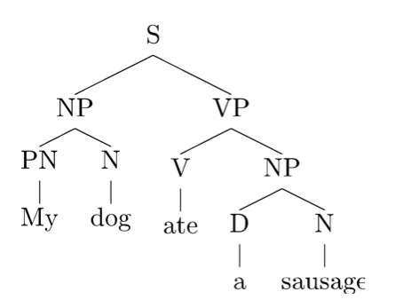
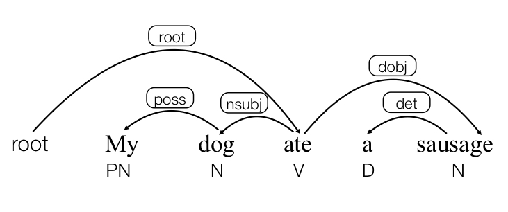
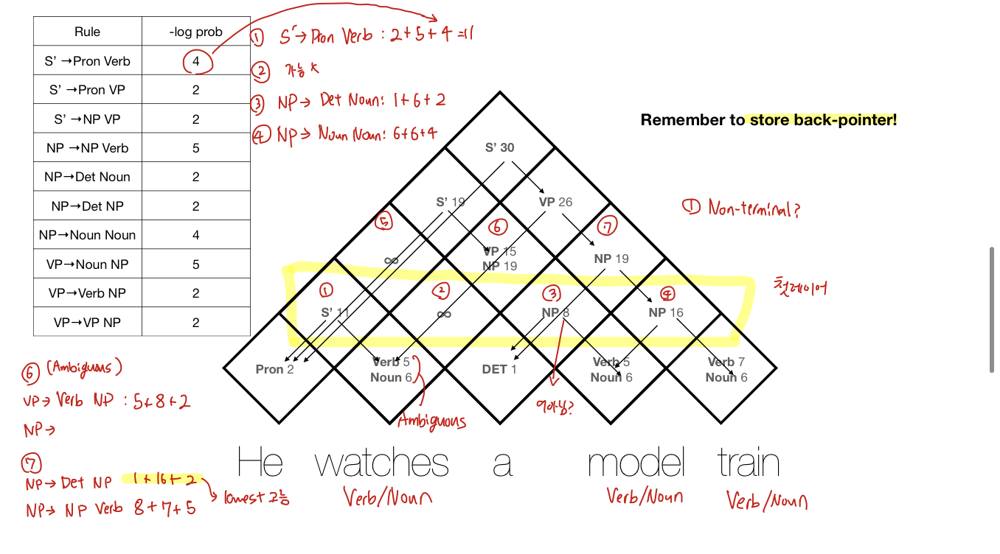

# 14 - Analysis 2 - Syntactic Parsing 1

## Table of Contents
* [Syntax](#Syntax)
* [Syntactic Parsing](#Syntactic-Parsing)
    * [Parts-of-Speech (POS)](#Parts-of-Speech-(POS))
    * [Parsing](#Parsing)
        * Constituency Trees
        * Dependency Trees
    * [Context-Free Grammars (CFGs)](Context-Free-Grammars-(CFGs))
        * Probabilistic Context-free Grammars (PCFGs)

# Syntax

문장을 이해하기 위해서는 language specific **patterns** 즉 syntax가 필요하다 (learning bias라고도 표현)

Study of **Patterns of formation** of sentences and phrases from words

Compositional & Recursive Patterns

- Compositional: Individual Pieces builds up
- Recursive: Sentence in sentence

# Syntactic Parsing

Trying to find Hidden Structures

Ambiguity: 어떻게 Parse하냐 따라서 의미가 달라질 수 있다.

ex) I saw the woman with the telescope wrapped in paper

기존에는 Parsing을 Treebank (annotated by hand)를 만들어서 supervised ML 적용하는 방식 이용

Morphology + Syntax + Semantics

- Morphology: Changing shape of words
- Semantics: Meaning

## Parts-of-Speech (POS)

Word 분류 카테고리로 볼 수 있다

**8개 정도 되는 Traditional POS**

- Noun, Verb, Adjective, Preposition, Adverb, Article, Interjection, Pronoun, Conjunction, Etc.
    - 예시) N, V, ADJ, ADV, P, PRO, DET
        - V (verb): state,event,action
        - ADJ (adjective): describing properties of object
        - ADV (adverb): words that modify sentences
            - 확실히 정의 애매한 것들 다른 카테고리가 아니면 여기 포함
        - DET (determiner): the, a, that,..

**POS 태깅이 Useful한 이유**

- First step of a vast number of practical tasks
- Speech Synthesis
    - 어떤 Tag냐 따라서 의미가 다를 수 있고 억양이 달라짐
    - ex) OBject (N), obJECT(V)
- Parsing: 단어가 Noun인지 Verb 인지
- Information Extraction
- Machine Translation

**Open and Closed Classes**

- Closed class: small fixed membership
    - 주로 Function words: hard to define semantics
        - Tree 구조 잡는 기능하는
- Open class: new ones can be created all the time
    - Nouns
        - Proper nouns: Names of Individual
        - Common nouns: the rest
        - Count nouns and mass nouns
            - Count: countable (plural)
            - Mass: not countable
    - Adverbs: tend to modify things
    - Verbs: 영어에서는 대체로 Verb만 형태 변함 (morphological changes)

Choosing a Tagest

- How finegrained?
    - 8 tag 같이 coarse하면 큰 의미가 없을 수도 있다
    - 주로 Penn Treebank Tagest 같이 fine-grained 된 태그셋 이용 (45tags)
        - 단어 / NN : 단어+slash+Category Marker 형태로 표연
        - Finegrained→Coarse 할 수록 Ambiguous한 (단어에 2~7개의 태그) Count가 증가

Pos Tagging은 disembiguate하며 해당 단어 instance의 Tag determine 하는 것이 문제

POS Tagging 방식

1. Rule-based
2. Stochastic,Probabilistic Sequence Models
    1. Hidden Markov Model (HMM) tagging
    2. Maximum Entropy Markov Models (MEMMs0
3. Neural
    1. Just use BERT! 
    

## Parsing

Predicting Syntactic Representation

다양한 형태의 Syntactic Representation 가능

- Constitency Tree (Phrase-structure)
    - Focus on Structure
    - Head of phrases 따로 마킹 x
- Dependency Tree
    - Focus on relations between words
    - doesn't tell you what the **phrases** are
    

### Constituency Trees

- Internal Nodes: Corresponds to **Phrases**
    - S: Sentence
    - NP: Noun Phrase, VP: Verb Phrase, PP: Prepositional Phrase
- Nodes Immediately above words: POS Tags
    - PN: Pronoun, D: Determiner, V: Verb, N: Noun, P: Preposition

Classic constituency tests: Replacement, Modification,..

제대로 Tree 구성 되었는지 Test

Constituency is not always clear

- Coordination: He went to and came from the store (?)
- Phonological Reduction: 'want to' → 'wanna'
    - Goes across levels/phrase boundaries
    

### Dependency Trees

Nodes are words with POS tags

Directed arcs encode syntactic dependencies

**Labels**: types of **relations** between words (Labels≠POS Tags)

- poss: possesive
- dobj: **direct** object
- nsubj: (noun) subject
- det: determiner (the,..)

Recovering **shallow semantics** - Quick and Easy 하다

- 'Tom ate sandwich' 문장에서 무엇을 누가 먹었는지 같은 shallow한 정보
- Some semantic info can be (approximately) derived from syntactic info
    - Subjects (nsubj) are often agents (initiators)
        - Not always! Verb가 non-agent를 subject로 가지는지 고려해야
    - Direct Objects (dobj) are **often** patients
    

## Context-Free Grammars (CFGs)

Main formalism people use to represent constituent grammar

다른 grammar formalism들 존재하나 harder to parse, but more info

Context-free: what can be valid subtree is only effected by **phrase type** but **not the context**

Ambiguity: Ambiguous 하면 표현하는 트리 종류가 다양해진다

- Dark ambiguities: Unknown words, new usages
- Need mechanism to focus attention on best ones → **Probabilistic** Techniques

### Probabilistic Context-free Grammars (PCFG)

Top-down production probability per rule

- X→ Y1,Y2,...YK 면 P(Y1,..YK | X)
- 확률로 Greedy하게나 beam등 가능하다 → 결론은 one best parse 찾도록

Estimated Probability of a rule (maximum likelihood estimate)

\alpha) = \frac{C(X->\alpha) }{C(X)}">
<!-- $$P(X->\alpha) = \frac{C(X->\alpha) }{C(X)}$$ -->

- C(X→a): # of times the rule was used in corpus
- C(X): # of times non-terminal X appeared in Treebank

Dynamic Programming 예시 (CYK Algorithm)

Can directly optimize log prob calculated by CKY with autograd

Neural PCFG

Neural L-PCFGs