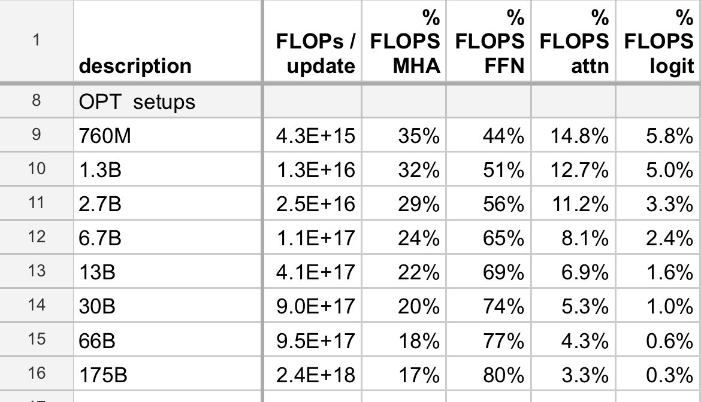

# Lecture 01 - Overview, tokenization
## Course Overview
### why_this_course_exists
**More is different**
* building small LM (<1B) might not be representative of LLMs
    * ex1. % of FLOPs between MHA & FFN changes as parameter increases
    * ex2. emergent behaviour may only appear in very large scales


**bitter lesson**
* **wrong** interpretation: scale is all that matters
* **right** interpretation: algorithms that **scale** is what matters

Let's maximize efficiency

`accuracy=efficiency*resources`

### course_components
```
Resources: data + hardware (compute, memory, communication bandwidth)
How do you train the best model given a fixed set of resources?
Example: given a Common Crawl dump and 32 H100s for 2 weeks, what should you do?
```

Overview:
| sections | description |
| --- | --- |
| basics | tokenization, model architecture, training |
| systems | kernels, parallelism, inference |
| scaling_laws | given FLOPS budget, determine the balance (model/data) |
| data | evaluation, data curation, preprocessing |
| alignment | sft, rlhf |


Efficiency drives design decisions
```
Data processing: avoid wasting precious compute updating on bad / irrelevant data
    
Tokenization: working with raw bytes is elegant, but compute-inefficient with today's model architectures.
    
Model architecture: many changes motivated by reducing memory or FLOPs (e.g., sharing KV caches, sliding window attention)
    
Training: we can get away with a single epoch!
    
Scaling laws: use less compute on smaller models to do hyperparameter tuning
    
Alignment: if tune model more to desired use cases, require smaller base models
```

## Tokenization
