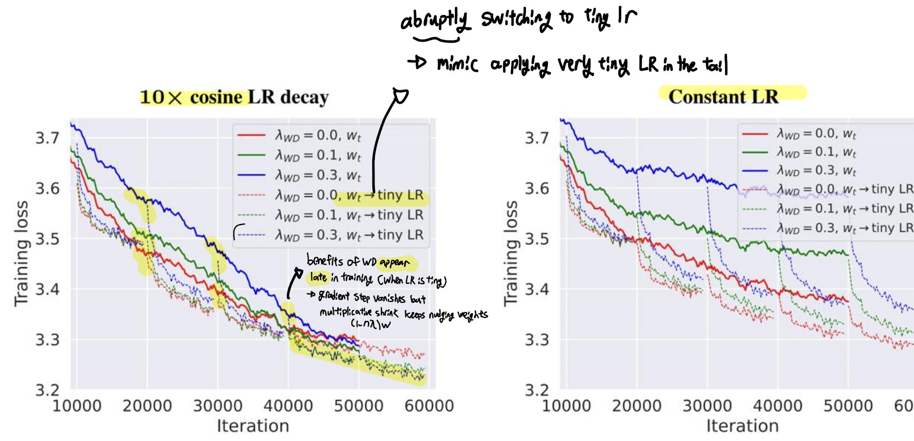

# Lesson3 - Architecure

Start: August 7, 2025
Status: In progress

Contents

- Common Architecture Variations:
    - Activations, FFN
    - Attention variatns
    - Position Embeddings
- Hyperparameters
    - ff_dim, sholud n_head * d_head always be d_model?
    - how many vocab elements?
- Stability Tricks

# 1. Starting Point

Original Transformer:

- Position Embedding: sin & cos (sin in even dim, cos in odd dim)
- FFN: ReLU
- Norm: ‘post’ norm, LayerNorm
    - LayerNorm: sample-level normalization,
        - ex. for (seq, d_model) input → normalized on last dimension (d_model, mean across tokens)
    - BatchNorm fails as batch gets smaller

CS336-Assignment 1 Implementation

- Position Embedding: RoPE
- FFN: SwiGLU
- Norm: ‘pre’ norm, RMSNorm
- Linear layers don’t have **‘bias’**
    - most modern transformers don’t have bias terms (in normalization or ffnn)
    - memory & optimization stability

<!-- - Recent (2025) LM Architecture Analysis
    
     -->
    

# 2. Architecture Variants

## 2-1. Normalization

### 2-1-1. Pre- vs Post-Norm

Almost all modern LMs use pre-norm

- pre-Norm positions norm to **not affect the main residual** signal path
- but BERT was post-norm

Original stated advantage of Pre-norm: removing warmup

Gradient Attenuation [[Xiaong 2020](https://arxiv.org/abs/2002.04745)]


- Gradient Expectation: Average gradient magnitude (norm)
    - g = dL/dW for some weight W
- Post-LN without warmup shows large variance in gradient expectation across layers (Orange)
    - needs warmup but pre-LN doesn’t

Today: stability and larger LRs for large networks

Gradient Spikes [[Salazar and Ngyuen 2019](https://arxiv.org/abs/1910.05895)]

- Post-norm exhibits very alrge erratic spikes → unstable

Recently some models try double normalization

- ‘double’: apply before & after attention/ffnn outside of residual stream

### 2-1-2. LayerNorm vs RMSNorm

LayerNorm: normalize mean, variance acoss d_model

- has bias term


```jsx
mean = x.mean(dim=-1, keepdim=True)  # shape: (batch_size, seq_len, 1)
var = x.var(dim=-1, unbiased=False, keepdim=True)  # shape: (batch_size, seq_len, 1)
```

RMSNorm

- only normalize using root mean squared sum (rms) and multiple learnable parameter
- no mean calculation, bias term → fewer operations (mean/var) & fewer parameters (bias)

Normalization can take about 25% of runtime (due to data movement)


## 2-2. Activations

History of common activations

- ReLU: Original transformer, T5, Chinchilla, OPT
- GeLU: GPT1~3, GPTJ, GPT-Neox, Bloom
- **SwiGLU, GeGLU:** LLama, PaLM, T5, most models post 2023

Gated Activations (GLU)

Given FF: `max(0, xW1)W2` GLU modifies the first part of a FF layer

- `max(0, xW1)` → `max(0, xW1) ⊙ xV`
    - element-wise multiplication with xV (V is extra trainable parameter)

→ Gated Variant (ReGLU) `(max(0, xW1) ⊙ xV)W2` 

- activation (relu) → gate → W2

Gated Variants of FF Layers

- GeGLU: uses GeLU as actiation
    - T5, Phi3, Gemma2,3
- SwiGLU: uses swish (`x*sigmoid(x)` ) as activation
    - Llama 1~3, Mistral, most models post 2023

Note:

- Gated models use smaller dimensions for the d_ff by 2/3
- GLU isn’t necessary, but probably helpful, shows consistent gains

## 2-3. Serial vs Parallel Layers

- Serial: Compute attention → FFNN
- Parallel layers: share the first layernorm → parallelize ffnn and attention
    - x + FFNN(LayerNorm(x + Attn(LayerNorm(x)))) → x + FFNN(LayerNorm(x)) **+** Attn (LayerNorm(x))
    - First by GPT-J, Recently cohere command A

No serious ablations but has compute advantage

## 2-4. Position Embeddings

Position Embeddings History

- Sine Embedding (Original transformer): **adds** sines and cosines that enable localization
- Absolute Embedding (GPT1~3, OPT): **adds** position vector to **embedding**
- Relative Embedding: (T5, Chinchilla): adds vector to **attention computation** ( Q(K+emb)^T )
- Rope (Llama, most 2024+): applies rotation to each pair of Q & K embedding indices
    - pair up coordinates (ex. (0,1) (2,3) of last dimension) and rotate them in 2D

### **RoPE (Rotary Position Embeddings)**

Issues with previous methods: attention function **only** gets to depend on relative position (no absolute position info)

- Sine: has **various** cross-terms that are relative
- Absolute: not relative
    - embeddings that are just mapped to a position, can’t extrapolative relative position difference
- Relative Emebddings: not an inner product (between Q & K)

Basis of RoPE

- embeddings should be invariant to absolute position
- inner products are invariant to arbitrary rotation

RoPE Implementation:

- ‘Rotate’ Q, K with Rotation matrix using matrix multiplication
- not additive, no cross-terms


Code-level Implementation

- Instead of implementing rotation matrix → matmul of d_model
- calculate inv_freq when initializing model
    - pre-calculated `1 / base^(2k/d)` (k=1~d_model//2)
    - during inference calculate `position_i * inv_freq[k]` as rotation degree
- split d_model into 2 parts (even/odd) → apply cos&sin matmul separately → combine

```jsx
freq = torch.einsum("... i, ... j->... ij", token_positions, self.inv_freq)
        
# rotation
cos = freq.cos()
sin = freq.sin()

# Split x (..., seq_len, d_k//2)
x_even = x[..., 0::2]
x_odd = x[..., 1::2]

# Rotate 
x_new_even = x_even*cos - x_odd*sin
x_new_odd = x_even*sin + x_odd*cos

# Interweave
x_new_even = x_new_even.unsqueeze(-1)
x_new_odd = x_new_odd.unsqueeze(-1)

# stack into (..., seq_len, d_k//2, 2) -> flatten
x_out = torch.cat([x_new_even, x_new_odd], dim=-1)
```

# 3. Hyperparameters

## 3-1. FeedForward (d_ff) - Model  (d_model) Dimension ratio

Almost always `d_ff = 4*d_model`

Few exeptions

- GLU Variants: GLU variants scale down by 2/3 → `d_ff = 4 * 2/3 * d_model = 8/3*d_model`
    - most models are close to 8/3 (2.666)
- T5: T5 has very bold settings
    - d_ff = 64 * d_model

## 3-2. n_head*d_head - d_model ratio

d_head > d_model//n_head is possible, but most models are equal

- some exceptions: google models

## 3-3. Aspect Ratio (d_model/n_layers, Deep or Wide)

Aspect ration = d_model/n_layers

Models are consistently within 100~200 range

- Depth: deep-models are harder to parallelize & have higher latency

## 3-4. Vocab Size

- Monolingual: 30~50K
- Multilingual/Production: 100K ~ 250K

## 3-5. Dropout & Other Regularization (Weight Decay)

Argument

- There is more data then parameters
- SGD only does single pass on a corpus

In practice

- Many older models use dropout
- Newer models only use weight decay

### Weight Decay

Weight decay is not to control overfitting, but interacting with learning rates(optimization dynamics)

- WD’s optimization effect is tied to LR schedule
- not a generalization regularizer in classical sense

Weight decay interacts with learning rates

- WD hurts optimization when LR is constant (mostly fights the gradient)
- Benefits of WD appear late in training when LR is tiny
    - gradient step vanishes, but multiplicative shrink (decay term) keeps nudging weights
- benefit of WD comes from how it modulates effective step size
- Shrinking weight norms reshape step sizes, helps model settle into better region



- plots above show abruptly switching to tiny LR (mimic applying very tiny LR in the tail)

# 4. Stability Tricks

## 4-1. Softmax

Issue points: exponentials, division by zero

Z-loss (PaLM)

- Softmax Normalizer (Z): sum of exp(logits)
- softmax normalizer can drift during training → cause numerical issues
- get log(Z) closer to 0 → get Z closer to 1


Logit soft-capping

- making logits stay between -soft_cap ~ +soft_cap
    - logit = soft_cap*tanh(logits/soft_cap)
- prevent logits from blowing up

## 4-2. Attention Heads (MQA, GQA, Sparse)

### GQA, MQA - Reducing attention head cost

Total arithmetric operations in attention calculation

| Part | FLOPS | Notes |
| --- | --- | --- |
| Q, K, V projections | 3*b*(n*d*d) |  |
| Scores QK^T | b*h*(n*k*n) = b*n*d*n |  |
| Matmul V | b*h*(n*n*k) = b*n*n*d |  |
| Output projection | b*(n*d*d) |  |

FLOPS calculation for matrix multiplication:


Total memory access: bn^2d + nd^2

→ Arithmetic intensity ((n/d + 1/b)^-1)

→ need short seq length or big model dimensions (n/d), need large batches (1/b)

- n/d term is difficult to reduce

We need to incrementally recompute/update attention via KV Cache


MQA (Multi-Query Attention)

- Multiple Q head, Single K,V head
- Can reduce KV Cache bandwidth (fewer items to move in,out of memory)
- all heads still produce separate outputs

GQA (Grouped Query Attention)

- In-between MHA and MQA
- GQA uses more memory than MQA, but is more expressive (key-query ratio)

| Method | # of KV Heads | K, V shape |
| --- | --- | --- |
| MHA | 1 | (b, seq, n_h, d_h) |
| MQA | 1 | (b, seq, 1, d_h) |
| GQA | G | (b, seq, G, d_h) |

### Sparse, Sliding window Attention

Sparse Attention: trades expressiveness & runtime

- mask out any connection where the distance between tokens is > window_size
- Calculate the absolute distance between each query and key → check >window_size

Sliding Window Attention: Let depth extend effective context


Current trick: interleave full & sliding attention